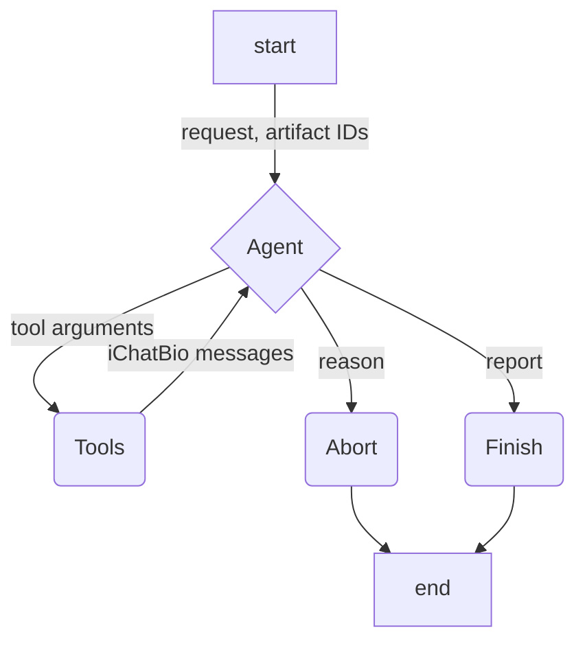

# LangChain example agent

An example agent that uses LangChain to call tools in a loop. When it thinks it's finished, it either completes the task
or aborts with an explanation.

```mermaid
flowchart TD
    A[start] -->|request, artifact IDs| B{Agent}
    B --> |tool arguments| C(Tools) --> |iChatBio messages| B
    B --> |reason| D(Abort) --> F[end]
    B --> |report| E(Finish) --> F
```
